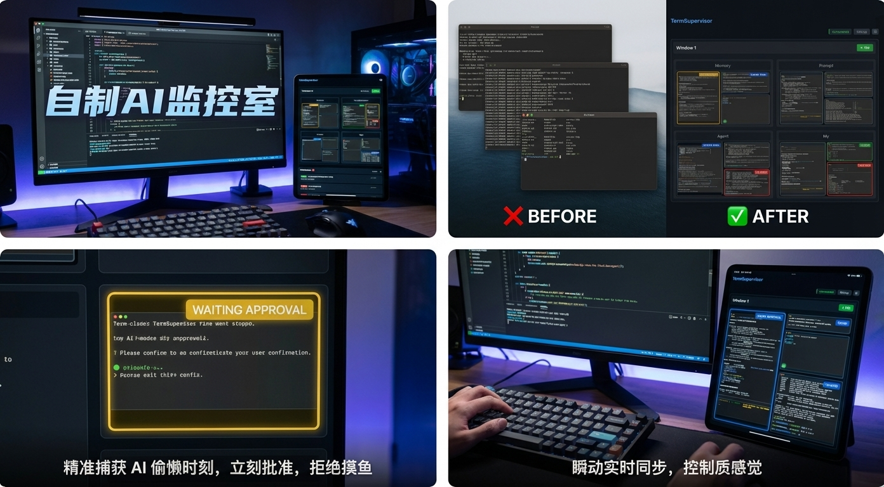
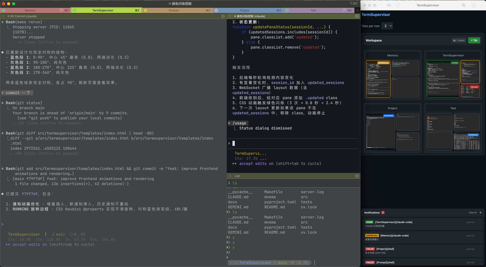
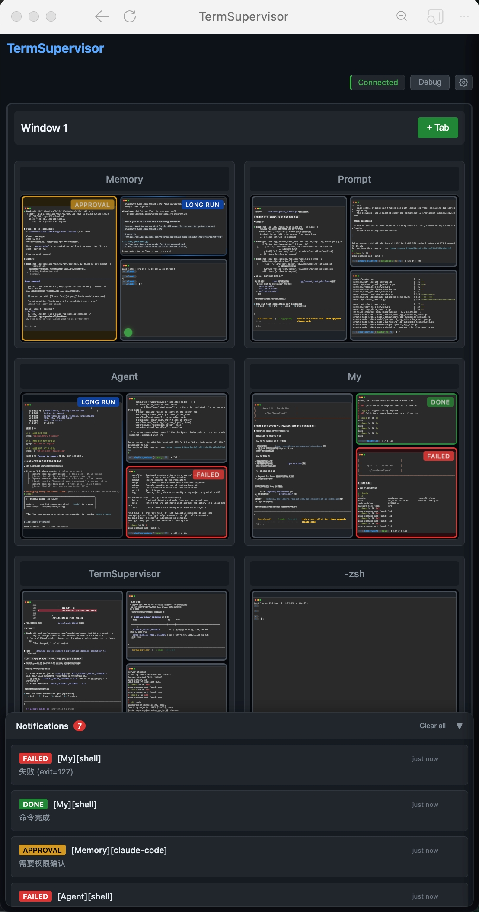

# TermSupervisor

A real-time web dashboard that monitors all your iTerm2 panes. See terminal states at a glance—running, waiting for approval, done, or failed—without switching windows. Built for developers running multiple AI agents (like Claude Code) in parallel.



| With iTerm2 | Standalone |
|:---:|:---:|
|  |  |

## Features

- **Real-time dashboard**: Mirrors the full iTerm2 layout with SVG rendering and per-pane status overlays.
- **Layout controls**: Adjustable tabs-per-row (1–6) via settings drawer, hidden-tab dropdowns, context menu rename/hide, and inline "+ Tab" with layout presets.
- **Interactive panes**: Click to activate in iTerm2, double-click to copy session ID, hover for path/process tooltip, focus badge indicator.
- **State pipeline**: HookManager → StateManager (per-pane ActorQueue + display layer) → PaneStateMachine.
- **Content change detection**: 1s polling → ContentCleaner → PaneChangeQueue throttling; refresh on ≥5 changed lines or 10s timeout (Render Pipeline, independent from Event System).
- **Notifications**: Floating panel with status colors; focus-aware suppression for <3s tasks or focused panes; auto-dismiss 60s after pane becomes IDLE.
- **Debug panel**: Real-time state machine monitoring via WebSocket subscription.

## Architecture

```
Signal Sources (shell | claude-code | iterm focus | frontend click)
        │
        ▼
┌──────────────────────────┐
│       HookManager        │ normalize + metrics + enqueue
└──────────┬───────────────┘
           ▼
┌──────────────────────────┐
│      StateManager        │ per-pane ActorQueue + display layer
└──────────┬───────────────┘
           ▼
┌────────────────┐
│PaneStateMachine│
│rules/history   │
└────────────────┘
        │
        ▼
      Status → WebSocket/UI
```

- `runtime/bootstrap.py` creates HookManager + Sources/Receiver.
- **Event System**: HookManager → StateManager (state events only, no content events).
- **Render Pipeline**: `TermSupervisor` polls iTerm2 → ContentCleaner → PaneChangeQueue → SVG refresh → WebSocket (independent from Event System).
- Hook sources: Shell PromptMonitor, Claude Code HTTP hook, iTerm focus debounce (0.3s); frontend actions use JSON messages on `/ws`.

### State Machine

5 states with explicit source isolation (no SOURCE_PRIORITY; rules use from_source):

| State | Trigger Events | Color | Visual Effect |
|-------|---------------|-------|---------------|
| IDLE | `idle_prompt`, `SessionEnd`, focus/click | - | Hidden |
| RUNNING | `command_start`, `PreToolUse`, `SessionStart` | Blue | Rotating border |
| WAITING_APPROVAL | `Notification:permission_prompt` | Yellow | Blinking |
| DONE | `command_end`(exit=0), `Stop` | Green | Blinking |
| FAILED | `command_end`(exit≠0) | Red | Blinking |

### Content Change Detection

```
1s Polling → ContentCleaner → PaneChangeQueue → SVG Refresh + content.changed → HookManager
                  │                  │
                  │                  ├── Refresh: ≥5 lines changed or 10s timeout
                  │                  └── Queue push: ≥20 lines changed
                  │
                  └── Unicode whitelist: letters, digits, CJK only
                      (filters ANSI, spinners, progress bars, punctuation)
```

## Project Structure

```
src/termsupervisor/
├── config.py               # All configuration constants
├── telemetry.py            # Logger + in-memory metrics facade
├── timer.py                # Interval/delay scheduler
├── supervisor.py           # Polling + layout mirror (Render Pipeline)
├── core/
│   └── ids.py              # ID normalization utilities
├── state/                  # State architecture
│   ├── manager.py          # StateManager (ActorQueue + display + Timer tasks)
│   ├── state_machine.py    # Transition processing + history
│   ├── transitions.py      # Rule table
│   ├── queue.py            # ActorQueue with generation/backpressure
│   ├── predicates.py       # Transition predicates
│   └── types.py            # Data types (HookEvent, DisplayState, TaskStatus, etc.)
├── hooks/
│   ├── manager.py          # HookManager facade (Event System entry)
│   ├── receiver.py         # HTTP /api/hook endpoint
│   ├── prompt_monitor.py   # iTerm2 PromptMonitor wrapper
│   └── sources/            # Shell, Claude Code, iTerm focus debounce
├── adapters/               # Terminal abstraction layer
│   ├── base.py             # TerminalAdapter interface
│   └── iterm2/             # iTerm2 implementation
│       ├── adapter.py      # ITerm2Adapter
│       ├── client.py       # iTerm2Client
│       ├── layout.py       # Layout traversal
│       ├── models.py       # Layout DTOs
│       └── naming.py       # Naming utilities
├── analysis/               # Content processing
│   ├── content_cleaner.py  # Unicode filter + hash
│   └── change_queue.py     # PaneChangeQueue throttling
├── render/                 # SVG renderer
├── runtime/
│   └── bootstrap.py        # Component construction
├── web/                    # FastAPI + WebSocket handlers
└── templates/index.html    # Frontend (vanilla JS)
```

## Docs

- Current architecture: `docs/state-architecture.md`
- Design source: `mnema/state-architecture/`
- Hook refactor notes: `docs/hook-manager-refactor.md`

## Current Status Notes

- runtime/bootstrap builds the single Timer + HookManager + Sources stack; per-pane ActorQueue + generation gating are active.
- **Event System** (HookManager → StateManager) handles state events only; **Render Pipeline** (Supervisor) handles content polling independently.
- WebSocket handler is JSON-only (`activate/rename/create_tab`); status changes broadcast from HookManager.
- `adapters/base.py` defines TerminalAdapter interface; `adapters/iterm2/` is the only implementation (tmux support planned).
- State is in-memory only; restart resets all state/history.
- Telemetry metrics are in-memory only (no Prometheus/StatsD sink yet).

## Install

```bash
uv sync
```

## Usage

**Prerequisite:** Enable Python API in iTerm2
- iTerm2 → Settings → General → Magic → Enable Python API

### Web Dashboard

```bash
make run          # Start in background
make stop         # Stop server
make rerun        # Restart

make viewlog      # View full log
make taillog      # Follow log
make loghook      # Monitor hook events only
make logerr       # Monitor errors only
```

Open http://localhost:8765

### Debugging State Pipeline

- New: `GET /api/debug/state/{session_id}?max_history=30&max_pending_events=10` (FastAPI). Returns status machine snapshot (status/source/state_id/description), display state, queue snapshot (depth, drops, pending signals), WAITING fallback info, recent history with failure reasons (`stale_generation`, `no_rule_matched`, `predicate_failed`), and current content hash. Use to see why a signal did or didn’t transition.
- Existing: `make loghook` to watch hook events, `make logerr` for errors, `make taillog` for server.log.
- Existing: In REPL/backend, `hook_manager.print_history(<pane_id>)` or `hook_manager.get_history(<pane_id>)` for recent transitions; `hook_manager.print_all_states()` to see tracked panes.

## Configuration

Edit `src/termsupervisor/config.py`:

```python
import os

# === Polling / Debug ===
POLL_INTERVAL = 1.0
EXCLUDE_NAMES = ["supervisor"]
DEBUG = True

# === User label ===
USER_NAME_VAR = "user.name"

# === Cleaner ===
CLEANER_MIN_CHANGED_LINES = 3
CLEANER_SIMILARITY_THRESHOLD = 0.9
CLEANER_DEBOUNCE_SECONDS = 5.0

# === Screen sampling ===
SCREEN_LAST_N_LINES = 30
MIN_CHANGED_LINES = 5

# === Actor queue ===
QUEUE_MAX_SIZE = 256
QUEUE_HIGH_WATERMARK = 0.75

# === Timer ===
TIMER_TICK_INTERVAL = 1.0

# === State / Display ===
STATE_HISTORY_MAX_LENGTH = 30
DISPLAY_DELAY_SECONDS = 5.0
NOTIFICATION_MIN_DURATION_SECONDS = 3.0
FOCUS_DEBOUNCE_SECONDS = 0.3

# === PaneChangeQueue ===
QUEUE_REFRESH_LINES = 5
QUEUE_NEW_RECORD_LINES = 20
QUEUE_FLUSH_TIMEOUT = 10.0

# === Logging / Metrics ===
LOG_LEVEL = os.environ.get("TERMSUPERVISOR_LOG_LEVEL", "INFO")
LOG_MAX_CMD_LEN = 120
MASK_COMMANDS = False
METRICS_ENABLED = True
```

## Claude Code Integration

1. Copy `hooks/claude-code/settings.json` to Claude Code hooks directory
2. Events sent to `POST /api/hook`:
   - `SessionStart`, `SessionEnd`
   - `PreToolUse`, `PostToolUse`, `SubagentStop`
   - `Stop` (task complete)
   - `Notification:permission_prompt`, `Notification:idle_prompt`

See `hooks/claude-code/README.md` for details.

## Makefile Commands

| Command | Description |
|---------|-------------|
| `make run` | Start in background |
| `make stop` | Stop server |
| `make rerun` | Restart (stop + run) |
| `make viewlog` | View full log |
| `make taillog` | Follow log |
| `make loghook` | Monitor hook events |
| `make logerr` | Monitor errors |
| `make debug-states` | List all pane debug snapshots |
| `make debug-state ID=<pane_id>` | View single pane state/queue details |
| `make test` | Run pytest |
| `make clean` | Clean logs and cache |

## Development

```bash
make test         # Run tests
make loghook      # Monitor events while developing
```
